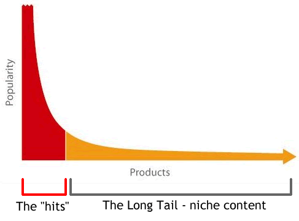

## Full Artist Discography

Do you like music? What kind of question is that, of course you do! I haven't met anyone who doesn't like some form of music.

But... have you ever asked yourself:
### 1. How many songs does an artist actually have? 
### 2. How many songs by said artist do I not know?
### 3. How many songs by that same artist do I not know that might actually enjoy?!

The answers might surprise you; there are probably quite a few tracks you've missed

Statistics show that only 10-20% of an artist's discography accounts for the majority of streams. This is what's known as the Long-Tail Effect, as shown below:


In terms of general knowledge of an artist's songs, most listeners only know about 20-30% of their music. 

This means that there's about 70-80% of songs that they haven't even listened to! This could encompass features, B-sides, or even just hits that they're not aware of!

Because of this, I have developed a program that, given an artists name, will generate a Spotify Playlist with their entire discography. This includes all their albums, singles, and tracks they are featured on. Now you can passively listen to their discography and hopefully discover new songs you enjoy.

Want to explore an artist's full discography? Follow the steps below to generate your playlist and discover new tracks!

(this requires moderate familiarity with Spotify's API so do some research on that if you can)

## Steps to Download and Run This Python Project

### 1. Clone the Repository
Once Git is installed, you can clone the repository to your local machine using the following command:

1. Open your terminal (Command Prompt on Windows, Terminal on macOS/Linux).
2. Run the following command:

   `git clone https://github.com/username/repository-name.git`

   Replace `username` with the owner of the repository and `repository-name` with the name of the repository.

3. Navigate into the project folder:

   `cd repository-name`

### 2. Check for Environment Configuration
Some projects require environment variables or configuration files (e.g., `.env` file). Make sure you:

1. Look for a `.env.example` file or similar, which provides example environment variables.
2. Copy and rename the `.env.example` file to `.env`, then fill in the necessary values.

   `cp .env.example .env`

3. Follow any specific instructions for environment variables as listed in the documentation.

### 3. Run the Project Using the `run.sh` Script
This project includes a `run.sh` script that handles dependency installation and ensures that Python 3.11.10 is being used. Follow these steps to run the project:

1. Make the `run.sh` script executable (if necessary):

   `chmod +x run.sh`

2. Run the script to install dependencies and start the application:

   `./run.sh`

### Script Details:
- The `run.sh` script does the following:
  - Ensures that **Python 3.11.10** is being used. If the correct version is not installed, an error message will be displayed, and the script will exit.
  - Installs the necessary dependencies from `requirements.txt`.
  - Executes the main Python script (`main.py`).

### 4. Additional Notes
- If you do not have **Python 3.11.10** installed, you will need to install it before running the project.
  - On **Ubuntu/Debian**: You can install Python 3.11.10 via `deadsnakes` PPA:
    ```bash
    sudo add-apt-repository ppa:deadsnakes/ppa
    sudo apt-get update
    sudo apt-get install python3.11
    ```
  - On **macOS**: You can install Python 3.11.10 using `brew`:
    ```bash
    brew install python@3.11
    ```
  - On **Windows**: You can download Python 3.11.10 from the official site: [https://www.python.org/downloads/release/python-3110/](https://www.python.org/downloads/release/python-3110/)


Let me know what you think!! Happy listneing :)
